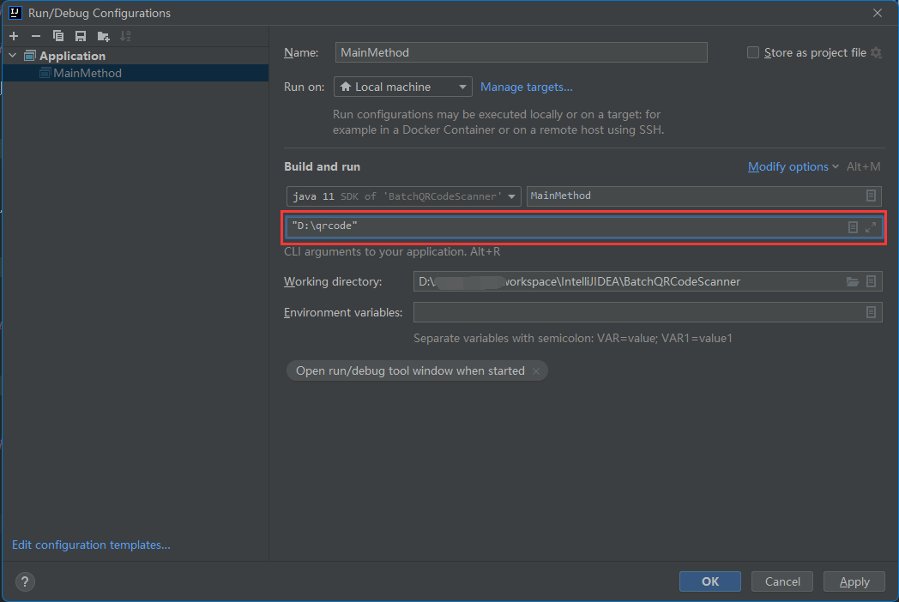

# BatchQRCodeScanner - 批量二维码图像文件扫描

本项目针对已经下载的批量二维码文件的扫描工作。

二维码扫描功能依赖 [zxing库](https://github.com/zxing/zxing) 。

# 针对不同情况的使用方式

## jar包运行

### 1. 二维码文件统一归类到文件夹

以下方式二选一即可：

+ jar包放到根目录运行

```shell
java -jar BatchQRCodeScanner.jar
```

+ 文件夹路径使用参数形式传入

```shell
java -jar BatchQRCodeScanner.jar "文件(夹)路径"
```

### 2. 散落的二维码文件

```shell
java -jar BatchQRCodeScanner.jar "文件(夹)路径1" "文件(夹)路径2" ...
```

## IDE中运行

下载源代码，在IDE的运行配置中添加参数



# 运行结果

运行结束后总是会在jar包相同目录下（IDE中则在项目根目录）输出三个文件，分别是：

+ scan_result.txt

“二维码文件扫描完成结果”文本文件，内容是所有二维码文件包含的内容。

+ scan_error.txt

“二维码文件扫描失败结果”文件（包括扫描失败和文件读取失败），内容是所有扫描失败的二维码文件的绝对路径。

+ log.txt

二维码扫描日志
